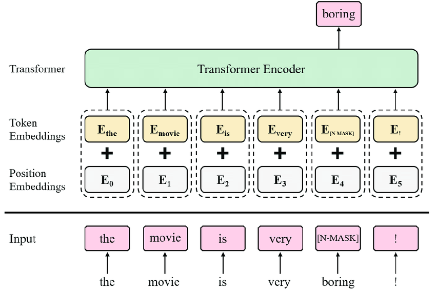

### Introduction - Use Cases

Document AI is one of the hottest areas in AI for businesses. Indeed, it goes without saying that automating low-value tasks is mandatory to reduce costs and improve operational performance. However, AI and such a model are not so easy to create, especially when it comes to a lot of different tasks.

One of these topics is document AI. It aims to automatically find information in various documents, regardless of their type and form.

> For example, someone might look at an invoice to find the name and date of the invoice. Invoices can be very different from one vendor to another, and it takes time to look through them. So AI can help the worker by finding the information and extracting it.

Also, Microsoft has develop Self-supervised pre-training techniques to solve this use case. The model we are going to describe and implement in the following document is **LayoutLMv3**.

### LayoutLMv3 : Theorical description

#### Conceptual approach

This model uses mainly three objectives in order to train the model : 
1. Masked Language Modeling (MLM) ;
2. Masked Image Modeling (MIM) ;
3. Word-Patch Alignement (WPA).

Thus, its main strength is that this model can learn on both text-centric documents (such as invoices) and more image-centric documents (such as contracts). 

> The use of this strategy is very promising because it uses the two strengths of both types of models:
> 1. it uses the position of each extracted box to learn how to find the information ;
> 2. it also uses the content of each box to learn how to find relevant information.

##### Masked Language Modeling 

This type of model has a fairly simple structure. Given an element to the model (such as a simple sentence), and masking some of the words, the algorithm tries to predict the masked elements using the context of the given element (other tokens' emneddings and positions' embeddings).

One of the most popular models using masked language modeling is BERT[1](https://arxiv.org/pdf/1810.04805.pdf) (Bidirectional Encoder Representations from Transformers).

The following example may give an idea of how this transformer works.

    

*An example of MLM. Taken from : [Self-Supervised Contextual Data Augmentation for Natural Language Processing](https://www.researchgate.net/publication/337187647_Self-Supervised_Contextual_Data_Augmentation_for_Natural_Language_Processing)*

How to Train a Masked Language Model (such as BERT)

1. **Tokenization:** The input is divided into tokens, and some of them are masked to train the model. The model predicts what the masked tokens were ;

2. **Embeddings:** Two embeddings are created - one for the position of the token in the input and another for the content of the algorithm ;

3. **Transformer Network:** Using these two embeddings, a transformer with a complex neural network predicts the masked values ;

4. **Evaluation Metrics:** Several metrics can evaluate the performance of the model, such as accuracy, BLUE (Bilingual Evaluation Understudy), or ROUGE (Recall-Oriented Understudy for Gisting Evaluation). However, unlike accuracy, BLUE and ROUGE evaluate the feasibility of the generated text.

##### Masked Image Modeling

Masked Image Modeling is another field of masked signal learning. The idea is quite similar to the MLM. This time, as you may expect, masked elements are images and not sentences, and the model try to rebuild the image, especially the masked area.

Nevertheless, this kind of algorithms is quite more complicated than MLM. Indeed, when it comes to images, several additionnal difficulties appears, such as : 
* A important correlation between two pixels (the probability of finding a pixel whose color is close to that of its neighbor is very high) ; 
* It is more difficult to transform pixels into tokens, because the signals are even more raw;
* it is possible to find continuous data instead of discrete data: this means that tokenization can lead to the creation of even more categories to classify information.

One of the pioneering work models using Masked Image Modeling is BEIT[2](https://arxiv.org/pdf/2106.08254.pdf)   (Bidirectional Encoder Representations from Transformers).

    

*An example of MIM using BEiT. Taken from : [BEIT: BERT Pre-Training of Image Transformers](https://arxiv.org/pdf/2106.08254.pdf)*

How to Train a Masked Image Model (such as BEiT)

1. **Train an Image Tokenizer:** This involves encoding the image into numerical tokens and decoding these tokens back to the image. This step is separate from the other steps.

2. **Divide the Image into Pieces:** After tokenizing the image, divide it into pieces. Some of these pieces are then masked, and the model is trained to fill in the missing parts.

3. **Flatten the Image:** Once the masked pieces are selected, flatten the image to provide a simple "list" to the encoder, rather than a raw 2D-image. The order of the pieces during flattening is crucial because it's part of the input for the encoder.

4. **Use an Encoder:** The encoder is given the positions and contents of every piece and generates a prediction for the masked pieces based on this information.

5. **Fill the Masked Area:** The predicted values fill the masked area in the flattened image. After reshaping the image, the decoder rebuilds the complete image.

6. **Compare Images:** The process concludes with a comparison between the original and predicted image.

##### Word-Patch Alignment

The objective of Word-Patch Alignment is to predict wheter the corresponding image patch of a text is masked. It's a bridge between the image-related part and text-related part.

Word vectors and image patch features are aligned using a cross-modal attention mechanism, where each word attends to the most relevant image patches and vice-versa.

##### Aggregation of 3 techniques in LayoutLMv3

LayoutMLv3 is a mix of these three techniques. The link between them is described in the image below.

    

*Summary of LayoutLMv3. Taken from : [LayoutLMv3: Pre-training for Document AIwith Unified Text and Image Masking](https://arxiv.org/pdf/2204.08387.pdf)*

### Strenghts of LayoutLMv3

**A Cross-Modal Approach**

Using only text-based documents, it's possible to extract information through word tokens. In long paragraphs, context can be inferred from previous and following sentences, and correlations between words in a sentence are important. However, this approach can be inefficient for structured documents with only a few words in each paragraph. In such cases, there is little context, and the model may struggle to accurately predict masked tokens.

Using only images, it's possible to predict information as an image, such as the location of masked areas. However, it's more difficult to predict the content within those areas, since every pixel has an important correlation with other pixels, and predicting text in such a document can be even more challenging.

Using a Word-Patch Alignment approach that combines words and image patches, the model can leverage the strengths of both modalities. By aligning words with image patches, the model can better understand the semantic meaning of the image and generate more accurate and meaningful captions. This cross-modal approach has been successfully used in various applications, including image captioning, visual question answering, and image retrieval.

**Training an Image-Based Model Without CNN :**

This model is based on images, but it does not use CNN, which is typically used in most image-based machine learning methods. Although it is a simple method, training requires GPUs and powerful machines due to the large number of weights.

However, LayoutLMv3 can simplify this process, reduce computational complexity, and eliminate some region annotations, thereby saving parameters.

### An example of LayoutLMv3 : 

#### Description of the use case

In this example, the objective is to **extract several information in an invoice**. Common fields to extract are for instance : 
* Name of the biller ;
* Address of the biller ;
* Due date ;
* GST ;
* Date of the invoice ;
* Number of the invoice...

#### Example Dataset 

##### Description

To illustrate the use of LayoutLMv3, a simple dataset might be a solution. Indeed, if the dataset is normalized and targeted information are in the same place in each document, performances will be high and it will demonstrate that the model is working well.

The dataset used in this example is a Hugging Face dataset named Darentang/generated (*https://huggingface.co/datasets/darentang/generated*). This dataset is already labeled, and every invoice has the same shape.

##### Content

Every invoice in this dataset has some information :
1. the id of the invoice in the dataset ;
2. the different tokens extracted from the invoice, which may be use for MLM part ;
3. the different bounding boxes, given by the OCR (optical character recognition), where every token is located ;
4. a NER tag for every invoice ;
5. a path to print the invoice in png.

#### Preparation for the training

The first step is to prepare data before training. Indeed, Hugging Face Datasets cannot be used instantly, and some pre-processing are required in order to fine tune the model on a given Dataset.

The dataset is divided into two datsets : one for the training of the model and one in order to validate performances of the fine tuning. As an example, 80% will be used for training and 20% for testing the model.

#### Fine Tuning of the model

We have to define appropriate metrics to fine-tune the model on this dataset. However, we face a challenge where the majority of the bounding boxes are labeled as "OTHER," indicating the absence of relevant information.

As a result, using accuracy as the primary metric for fine-tuning is not suitable. If we do so, the model may assign the label "OTHER" to every box, resulting in the failure to extract any useful information.

Furthermore, due to the similarities among every invoice, it is feasible to fine-tune the model with a relatively small number of epochs. The model is likely to converge quickly, and therefore there is no need to train it for hours.

| Step | Training Loss | Validation Loss | Precision | Recall | F1 |
|------|---------------|-----------------|-----------|--------|----|
|50|No log|0.013665|0.972000|0.985801|0.978852|0.997051|
|100|0.016600|0.010173|0.972000|0.985801|0.978852|0.997051|
|150|0.016600|0.008906|0.972000|0.985801|0.978852|0.997051|
|200|0.010300|0.005441|0.987854|0.989858|0.988855|0.998736|
|250|0.010300|0.003199|0.995951|0.997972|0.996960|0.999579|
|300|0.004600|0.003948|0.995951|0.997972|0.996960|0.999579|
|350|0.004600|0.004153|0.995951|0.997972|0.996960|0.999579|
|400|0.003300|0.001833|0.997972|0.997972|0.997972|0.999789|
|450|0.003300|0.002308|0.997972|0.997972|0.997972|0.999789|
|500|0.002700|0.002393|0.997972|0.997972|0.997972|0.999789|

**Table 1 :** *Performances of fine tuning on Darentang's Dataset.*

The F1 is really close of 100%. As a conclusion, the fine tuning of the model lead to a model which extract relevant information with a high level of confidence. indeed, most of the information are correctly extracted and it is possible to use this tool like this.

##### Limit of this example 

The example discussed above has certain limitations that need to be considered:

* The dataset used for the example is almost perfect, with all invoices having a similar structure. However, in reality, invoices can differ significantly in shape and content. As a result, the model's performance is likely to suffer when dealing with such varied datasets ;
* The quality of information extracted by the model is highly dependent on the quality of OCR. Even if the model performs well in terms of labeling (as shown in the table), incorrect information can be extracted if the OCR is not accurate enough. For instance, if the date of the invoice is 14/01/2023 and the OCR extracted 44/01/2023, labeling might be great, but information false. To address this issue, the model should be combined with a set of rules to verify and normalize the extracted information ;
* Fine-tuning this kind of model requires labeled data, which can be a time-consuming and challenging task. Without labeled data, it is impossible to train the model effectively.

## Sources

**LayoutLMv3**
* https://huggingface.co/docs/transformers/model_doc/layoutlmv3
* https://arxiv.org/pdf/2204.08387.pdf

**Masked Language Modeling**
* https://towardsdatascience.com/the-most-common-evaluation-metrics-in-nlp-ced6a763ac8b

**Masked Image Modeling**
* Zhiliang Peng, Li Dong, Hangbo Bao, Qixiang Ye, Furu Wei, *A Unified View of Masked Image Modeling*, 2022, https://arxiv.org/pdf/2210.10615.pdf
* Hangbo Bao,  Li Dong,  Songhao Piao,  Furu Wei, *BEIT: BERT Pre-Training of Image Transformers*, 2021,  https://arxiv.org/pdf/2106.08254.pdf

